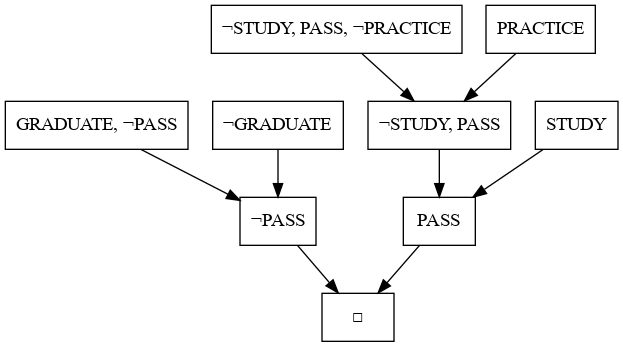

# propositional-logic-prover-python
The goal of this project is to develop a propositional logic prover based on the resolution refutation algorithm. This tool can be used for many applications, including automated reasoning.

Main features:
- Prover:
    - The tool accepts a WFF knowledge base and a WFF query as string.
    - It outputs the validity of the query given the knowledge base, and the derivation (proof by contradiction).

- Solution visualizer:
    - Print the derivation on the terminal.
    - Save the derivation as a PNG image.

Note:
- This project was tested using Python 3.12.4 on Ubuntu.
- This tool is primarily designed for educational purposes and is not optimized for performance.

## Installation
1. Before starting, you need to have Python installed on your system.
2. Clone or download the project repository.
3. Install Poetry.
4. Install the project with Poetry. Run the following at the root of the project:
    ```shell
    $ poetry install
    ```

## Usage

To use the propositional logic prover, activate the project environment and execute the `prover-cli` command with the knowledge base and query as WFF strings. You can use the flags `-p` or `--print` to print a possible derivation and the argument `-g` (or `--generate`) followed by a filename to generate the corresponding PNG image.

Here is an example of using the CLI:
```shell
$ prover-cli "(((STUDY&PRACTICE)=>PASS)&(PASS=>GRADUATE))" "((STUDY&PRACTICE)=>GRADUATE)" -p -g "example"
```

If successfully proved, the output will be:
```
□
├── ¬PASS
│   ├── GRADUATE, ¬PASS
│   └── ¬GRADUATE
└── PASS
    ├── ¬STUDY, PASS
    │   ├── ¬STUDY, PASS, ¬PRACTICE
    │   └── PRACTICE
    └── STUDY
```

And a PNG image named "example.png" containing the derivation will be created in the current directory. The resulting derivation will look as follows.




## License
This project is licensed under the Apache 2.0 license.
See the LICENSE file for more information.

## Acknowledgements
This project utilizes the following open-source libraries:
- `prettytable`:
    - Version: 2.12.1
    - License: Apache-2.0
    - Project website: https://github.com/c0fec0de/anytree
    - Purpose: provides tools and classes for working with tree data structures.

Special thanks to the authors and contributors who dedicated their time and effort to develop these libraries. Their hard work and valuable contributions have greatly benefited the software development community.

## Contact
If you have any questions or inquiries, please contact raphael.bonatti@algolance.com.
